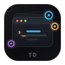
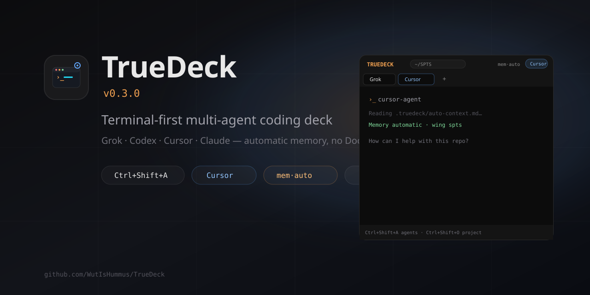

<p align="center">
 
</p>

# TrueDeck

**Terminal-first multi-agent coding deck** - between a Codex-style TUI and a plain shell.

Run **Grok**, **Codex**, **Cursor**, **Claude**, **Gemini**, and more as live terminal tabs. 
Memory is **wired into your CLI** (no Docker UI, no `mem·auto` badge to babysit). 
VS Code-style **pane groups**: side-by-side or stacked, with clear Group A / B tabs.

[](./LICENSE)
[](https://github.com/WutIsHummus/TrueDeck/releases)

<p align="center">
 
</p>

## Highlights

| | |
|--|--|
| **Studio UI** | Thin chrome, almost all terminal - not a 3-column IDE |
| **Multi-agent tabs** | Grok · Codex · Cursor · Claude · Gemini · Shell · OpenCode · Aider |
| **Pane groups** | Drag tabs to **Left / Right / Top / Bottom**; each group keeps its own tabs |
| **Project menu** | VS Code-style folder name + chevron (recent + Open Folder) |
| **MCP deck** | Agents launch briefed CLIs via `truedeck_launch` (no board UI) |
| **Agent frame** | Optional in-terminal TrueDeck chrome around coding CLIs |
| **Automatic memory** | Inject MCP / project pointers into your preferred CLI on onboarding |
| **Session restore** | Reopen last project + respawn agent tabs after quit |
| **Fast spawn** | PTY opens first; MemPalace / inject run in the background |

## Documentation

**Site (GitHub Pages):** [wutishummus.github.io/TrueDeck](https://wutishummus.github.io/TrueDeck/)

Source lives under **[docs/](./docs/)** (TrueDeck **0.3.x**). Local preview:

```bash
npm run docs:dev      # http://localhost:5174
npm run docs:build    # static site → docs/.vitepress/dist
```

| Guide | Description |
|-------|-------------|
| [Docs home](./docs/index.md) | Landing + overview |
| [Getting started](./docs/getting-started.md) | Install, first project, first agent |
| [User guide](./docs/user-guide.md) | Projects, panes, board, settings, restore |
| [Keyboard shortcuts](./docs/keyboard-shortcuts.md) | Complete shortcut table |
| [Architecture](./docs/architecture.md) | Electron, PTY backends, MCP, memory |
| [Agents](./docs/agents.md) | CLI resolve, Cursor IDE block |
| [Task board](./docs/task-board.md) | Dispatch, task files, env vars |
| [Agent frame](./docs/agent-frame.md) | `truedeck-frame.mjs` chrome |
| [Configuration](./docs/configuration.md) | Settings, env, data dirs |
| [MCP](./docs/mcp.md) | Unified hub + tools |
| [Development](./docs/development.md) | Scripts, packaging, contributing |
| [Troubleshooting](./docs/troubleshooting.md) | Common fixes |
| [Memory providers](./docs/memory-providers.md) · [Rust backend](./docs/RUST-BACKEND.md) · [Fast PTY](./docs/FAST-PTY.md) | Advanced / optional |

## What’s new (current)

- **Pane groups** - side-by-side *and* stacked; selecting a tab no longer collapses the other pane 
- **Onboarding** - pick CLI → pick memory space (or existing palace) → repo → inject + launch 
- **No memory badge** - memory is abstracted into agents 
- **Ctrl shortcuts** that work **inside the terminal** (xterm no longer steals them) 
- **Memorable TD mark** - stacked deck + cool “D” focus node 
- **Custom Windows title bar** + app icon (`.ico` for taskbar / installer)

## Quick start

### Requirements

- Node.js 20+
- Windows, macOS, or Linux 
- Optional **coding agent CLIs** on `PATH`: `grok`, `codex`, `claude`, `gemini`, `cursor-agent`, …

> **Note:** Tools like **Rojo** (Roblox sync) are **not** coding-agent CLIs. 
> You can still add them as **on-open project commands** (e.g. `rojo serve`) in Settings → Project - they run as shell panes when you open that folder.

### Install & run

```bash
git clone https://github.com/WutIsHummus/TrueDeck.git
cd TrueDeck
npm install
npm start
```

| Command | What |
|---------|------|
| `npm start` | Studio UI (default) |
| `npm run tui` | Terminal-only deck |
| `npm run icons` | Rebuild PNG/ICO from `resources/icon.svg` |
| `npm run build:pty` | Build Rust PTY sidecar (`truedeck-pty`) |
| `npm run build` | Production compile |
| `npm run dist:win` | Windows installer (electron-builder) |

### Optional: Rust backend

TrueDeck can run a **native Rust backend** (`crates/truedeck-backend`) for PTY, projects, settings, layout, and memory inject. Electron stays the UI shell. If the binary is missing, it falls back to TypeScript + **node-pty**.

```powershell
# 1) Free disk space + install Rust (https://rustup.rs) + MSVC build tools
# 2) From repo root:
npm run build:backend
npm start
# Log: [backend] rust truedeck-backend 0.1.0
```

Details: [docs/RUST-BACKEND.md](./docs/RUST-BACKEND.md).

## Keyboard shortcuts

Use **Ctrl** (or **⌘** on macOS). These work even when a terminal tab is focused 
(TrueDeck claims them before xterm / the agent CLI). Full table: [docs/keyboard-shortcuts.md](./docs/keyboard-shortcuts.md).

| Shortcut | Action |
|----------|--------|
| **Ctrl+T** | New agent (palette) |
| **Ctrl+O** | Open folder |
| **Ctrl+W** | Close tab |
| **Ctrl+S** | Settings |
| **Ctrl+D** | Split vertical (side-by-side) |
| **Ctrl+X** | Split horizontal (top / bottom) |
| **Ctrl+Alt+D** or **Ctrl+Alt+X** | Merge to one pane |
| **Ctrl+← ↑ ↓ →** | Focus neighboring pane (or cycle tabs) |
| **Ctrl+N** | New shell tab |
| **Ctrl+Tab** | Next tab (focused pane group) |
| **Ctrl+1-9** | Jump to tab |

Terminal still receives normal keys and combos like **Ctrl+C** / **Ctrl+A**.

## UI map

```
┌─ title bar: icon · TRUEDECK · [Project ▾] · ⚙ · ? · window ─┐
├─ layout toolbar: split hints · ▥ ▤ merge · + · clear ────────┤
├─ Group A tabs ──────────────┬─ Group B tabs ────────────────┤
│ terminal │ terminal │
│ (active agent) │ (or stacked below) │
└─────────────────────────────┴───────────────────────────────┘
```

- **Project ▾** - open recent or browse a folder 
- **Drag a tab** onto Left / Right / Top / Bottom zones to split 
- **Center** drop joins that tab into a group 
- **+** or **Ctrl+T** - launch agents 


## Memory (automatic)

During onboarding you choose:

1. **Preferred CLI** (Cursor, Claude, Codex, Grok, …) 
2. **Memory space** - default palace, detected folder, or browse an existing one 
3. **Repo** - TrueDeck injects MCP + `.truedeck/auto-context.md` + `.memory/` pointers 

After that, agents inherit env + config; you don’t manage a memory panel. 
Details: [docs/memory-providers.md](./docs/memory-providers.md).

### Optional MemPalace (native, no Docker)

```powershell
uv tool install mempalace
.\tools\ensure-mempalace.ps1
```

## Onboarding

1. Welcome 
2. Pick your **CLI** 
3. Pick / create a **memory space** 
4. Connect a **repo** 
5. **Inject + launch** 

Replay: **?** in the title bar, or Settings → About → Replay onboarding.

## Project layout

```
TrueDeck/
 src/ # Studio UI (React + xterm + pane groups)
 electron/ # Main: PTY, memory inject, session restore
 tui/ # Optional terminal UI
 resources/ # icon.svg → icon.ico / PNGs
 build/ # electron-builder icons
 docs/ # product docs (start at docs/README.md)
 tools/ # icons generator, MemPalace helpers
```

## Brand assets

| File | Use |
|------|-----|
| [resources/icon.svg](./resources/icon.svg) | Source mark (regenerate with `npm run icons`) |
| [resources/icon.ico](./resources/icon.ico) | Windows window + taskbar |
| [docs/banner.svg](./docs/banner.svg) | GitHub / social banner |

## Updates

TrueDeck checks GitHub Releases on launch. If a newer tag exists, an **Update** button appears in the title bar.

```bash
git tag v0.3.1
git push origin v0.3.1
gh release create v0.3.1 --title "TrueDeck v0.3.1" --notes "Pane groups, CLI memory inject, shortcut fix, new icon."
```

## License

MIT - see [LICENSE](./LICENSE).

## Related

- [MemPalace](https://github.com/MemPalace/mempalace) - local AI memory (native MCP) 
- [Handy](https://github.com/cjpais/Handy) - free offline speech-to-text 
- [Claude Squad](https://github.com/smtg-ai/claude-squad) · [Agent Deck](https://github.com/asheshgoplani/agent-deck)
