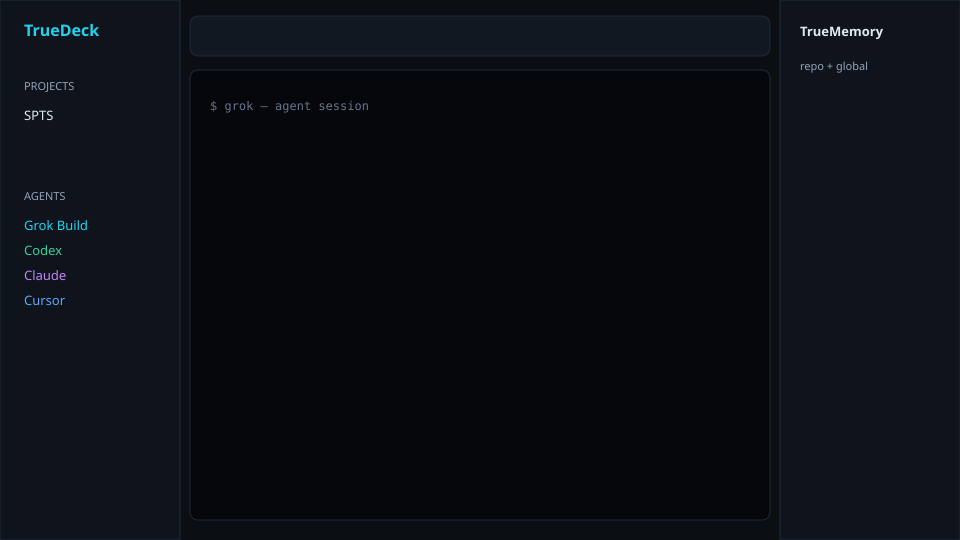

# TrueDeck

**Free, open-source multi-agent coding workbench** — Agent Deck style, mouse-first UI, real terminals.

Run **Grok Build**, **Codex**, **Claude Code**, **Cursor Agent**, **Gemini**, **OpenCode**, **Aider**, or any CLI side by side. Each project gets durable **TrueMemory**, plus a **global** memory shared across every repo.

> BridgeSpace alternative without the subscription: multi-pane agents, on-open commands (`rojo serve`), and markdown memory you can commit.



## Features

| Feature | What it does |
|--------|----------------|
| **Agent grid** | BridgeSpace-style **Grid** view — see multiple agents at once; or classic **Tabs** |
| **Multi-CLI** | Grok, Codex, Claude, Cursor Agent, Gemini, OpenCode, Aider, Shell — edit presets in `agents.json` |
| **Smart Cursor** | Resolves `cursor-agent` → `cursor agent` → Cursor IDE fallback |
| **On-open commands** | Per project: auto-run `rojo serve`, `npm run dev`, etc. when you open the folder |
| **First-run seed** | Auto-discovers local projects (e.g. `~/SPTS`) with sensible defaults |
| **TrueMemory (repo)** | `.memory/` inside each project — commit it like code |
| **TrueMemory (global)** | Cross-project prefs under app data |
| **MemPalace (native)** | Default “mem space” via `mempalace-mcp` — **no Docker** |
| **Pluggable memory** | Toggle MemPalace / OpenMemory / custom MCP from the UI |
| **Speech-to-text ready** | Focus a terminal + [Handy](https://github.com/cjpais/Handy) or **Win+H** |

## Memory backends (no Docker required)

TrueDeck stacks layers you can turn on/off:

| Backend | Role |
|---------|------|
| **TrueMemory** | Always on — markdown in `.memory/` + global files |
| **MemPalace** | Default mem space — **native** MCP only (`noDocker: true`) |
| **OpenMemory** | Optional Mem0 MCP — enable when installed |
| **Custom MCP** | Paste any memory server command |

UI: right panel → **Memory backends** → toggle / **+ Custom MCP** / **Export MCP** (Cursor + Grok snippets).

Details: [docs/memory-providers.md](./docs/memory-providers.md)

### MemPalace without Docker

```powershell
uv tool install mempalace
.\tools\ensure-mempalace.ps1
```

Cursor / Grok should use native MCP (already configured if you ran our setup):

```text
command: %USERPROFILE%\.local\bin\mempalace-mcp.exe
args:    --palace %USERPROFILE%\.mempalace\palace
```

```powershell
# one-shot switch away from docker run
.\tools\install-native-mempalace-mcp.ps1
```

Restart Cursor / Grok after changing MCP config.

## Quick start

### Requirements

- Node.js 20+
- Windows, macOS, or Linux
- Optional CLIs on PATH: `grok`, `codex`, `claude`, `gemini`, `cursor`, `opencode`, `aider`, `rojo`, …

### Install & run

```bash
git clone https://github.com/WutIsHummus/TrueDeck.git
cd TrueDeck
npm install
npm run dev
```

Build a desktop binary:

```bash
npm run dist:win   # or dist (dir), electron-builder targets in package.json
```

### First session

1. **+ Open** a project folder (e.g. your Roblox/Rojo repo).
2. Configure **On open…** → enable `rojo serve` (auto-suggested when `default.project.json` exists).
3. Click the project again (or open it) to spawn on-open panes + default agents.
4. Use toolbar **+ Grok / + Codex / + Claude / + Cursor / + Gemini** for more tabs.
5. Edit **TrueMemory** on the right:
   - **This repo** → `.memory/` in the project
   - **Global** → shared across all projects

### Speech-to-text

```powershell
winget install cjpais.Handy
```

Set a push-to-talk hotkey in Handy, focus a TrueDeck terminal tab, speak. Or use **Win+H**.

## TrueMemory protocol

Agents and humans share plain markdown:

```
.memory/
  INDEX.md
  context/      # durable facts
  patterns/     # how-tos
  decisions/    # ADRs
  sessions/     # optional day logs
```

**Global memory** lives in the TrueDeck app data directory (`memory/`), same layout.

Tip for agents: at session start, read both `INDEX.md` files when present.

## Customize agents

After first run, edit:

- **Windows:** `%APPDATA%\truedeck\data\agents.json`
- **macOS:** `~/Library/Application Support/truedeck/data/agents.json`
- **Linux:** `~/.config/truedeck/data/agents.json`

Example preset:

```json
{
  "id": "cursor",
  "name": "Cursor Agent",
  "command": "cursor",
  "args": ["agent"],
  "color": "#60a5fa",
  "icon": "◆",
  "description": "Cursor agent CLI"
}
```

Projects store: `…/data/projects.json` (on-open commands + default agent tabs).

## Stack

- **Electron** + **electron-vite** + **React** + **TypeScript**
- **node-pty** + **xterm.js** (real PTYs, mouse-selectable UI)
- **Zustand** for UI state
- Markdown on disk for memory (no vendor lock-in)

## Roadmap

- [x] Split panes / grid layout (BridgeSpace-style)
- [x] Reliable Cursor agent resolution
- [x] First-run project seeding
- [x] CI + Windows release workflow
- [ ] Drag-and-drop pane resize / reorder
- [ ] Built-in Whisper STT (optional)
- [ ] MCP bridge for shared memory across external tools
- [ ] Session cost / status badges per agent
- [ ] Portable agent-deck import/export

## Releases

Tag a version to build Windows installers:

```bash
git tag v0.2.0
git push origin v0.2.0
```

Or run the **Release** workflow manually from GitHub Actions.

## Contributing

PRs welcome. Keep the core philosophy:

1. **Real terminals** for real CLIs (not fake chat-only agents)
2. **Memory as files** (repo + global), not a black-box cloud
3. **Mouse-first** desktop UX without hiding the terminal

## License

MIT — see [LICENSE](./LICENSE).

## Related

- [Handy](https://github.com/cjpais/Handy) — free offline speech-to-text
- [Claude Squad](https://github.com/smtg-ai/claude-squad) — TUI multi-agent manager
- [Agent Deck](https://github.com/asheshgoplani/agent-deck) — terminal session manager inspiration
