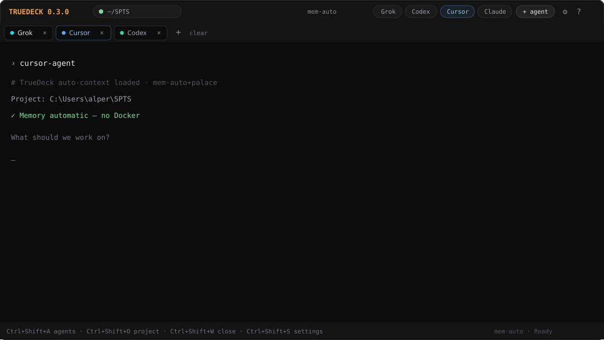

<p align="center">
  
</p>

# TrueDeck

**Terminal-first multi-agent coding deck** — between a Codex-style TUI and a plain CLI.

Run **Grok**, **Codex**, **Cursor**, **Claude**, **Gemini**, and more as live terminal tabs.  
**Automatic memory** (no Docker, no memory panels to babysit). Drag tabs, split, ship.

[](./LICENSE)
[](https://github.com/WutIsHummus/TrueDeck/releases)

<p align="center">
  
</p>

<p align="center">
  
</p>

## What’s new in v0.3.0

- **Studio UI** — thin chrome, almost full terminal, not a 3-column IDE
- **Cursor** as a first-class agent (quick chip + palette)
- **Onboarding** — connect a repo, learn `mem·auto`, launch an agent
- **Ctrl+Shift shortcuts** — easy, works inside agent terminals
- **Drag-and-drop tabs** — reorder, drop to split, context menu
- **Settings** (Ctrl+Shift+S) — font, theme, on-open commands, updates
- **Update button** when a newer GitHub release exists
- **Automatic memory** — `.truedeck/auto-context.md` + MemPalace (native)

## Features

| Feature | What it does |
|--------|----------------|
| **Studio + TUI** | Electron studio (`npm start`) or pure terminal (`npm run tui`) |
| **Multi-CLI** | Grok, Codex, Cursor, Claude, Gemini, Shell, OpenCode, Aider |
| **Smart Cursor** | Resolves `cursor-agent` → `cursor agent` → Cursor IDE |
| **On-open commands** | e.g. `rojo serve` when you open a Roblox project |
| **Onboarding** | First-run walkthrough; replay with **?** |
| **mem·auto** | Status only — memory runs for you (files + optional MemPalace) |
| **Drag tabs** | Reorder · drop on stage to split · middle-click close |
| **Updates** | Title-bar **Update** when a newer release is on GitHub |

## Quick start

### Requirements

- Node.js 20+
- Windows, macOS, or Linux
- Optional CLIs on PATH: `grok`, `codex`, `claude`, `gemini`, `cursor-agent`, `rojo`, …

### Install & run

```bash
git clone https://github.com/WutIsHummus/TrueDeck.git
cd TrueDeck
npm install
npm start
```

| Command | What |
|---------|------|
| `npm start` | Studio UI (default) |
| `npm run tui` | Full terminal deck |
| `npm run build` | Production compile |
| `npm run dist:win` | Windows installer (electron-builder) |

## Keyboard shortcuts

All app shortcuts use **Ctrl+Shift** so they work even while an agent terminal is focused:

| Shortcut | Action |
|----------|--------|
| **Ctrl+Shift+A** | Agent list |
| **Ctrl+Shift+O** | Open project |
| **Ctrl+Shift+W** | Close tab |
| **Ctrl+Shift+S** | Settings |
| **Ctrl+Shift+T** | Next tab |
| **Ctrl+Shift+D** | Split / unsplit |
| **Ctrl+Shift+N** | New shell |
| **Ctrl+Shift+1–9** | Jump to tab |

You can also click **Grok · Codex · Cursor · Claude** or **+ agent**.

## What is `mem·auto`?

A **status badge**, not a control.

TrueDeck automatically:

1. Ensures `.memory/` for the repo  
2. Writes `.truedeck/auto-context.md` for agents  
3. Warms **MemPalace** natively (no Docker) when installed  
4. Background-mines the project into a wing  

You don’t manage memory UI. See [docs/memory-providers.md](./docs/memory-providers.md).

### Optional MemPalace (native)

```powershell
uv tool install mempalace
.\tools\ensure-mempalace.ps1
```

## Onboarding

First launch opens a short tour:

1. Welcome  
2. Explain chrome (`mem·auto`, agent chips, + agent, settings)  
3. Connect a local repo  
4. Launch Cursor / Grok / Codex / Claude  
5. Done  

Replay anytime: **?** in the title bar, or **Settings → About → Replay onboarding**.

## Project layout

```
TrueDeck/
  src/                 # Studio UI (React + xterm)
  electron/            # Main process, memory service, updates
  tui/                 # Terminal UI alternative
  resources/icon.svg   # App icon
  docs/                # Banner, preview, memory docs
  tools/               # MemPalace helpers
```

## Brand assets

| File | Use |
|------|-----|
| [resources/icon.svg](./resources/icon.svg) | App icon |
| [resources/icon-simple.svg](./resources/icon-simple.svg) | Small mark |
| [docs/banner.svg](./docs/banner.svg) | GitHub / social banner |
| [docs/studio-preview.svg](./docs/studio-preview.svg) | UI preview |

## Updates

TrueDeck checks GitHub Releases on launch. If a newer tag exists, an amber **Update** button appears.

Publish a release:

```bash
git tag v0.3.0
git push origin v0.3.0
gh release create v0.3.0 --title "TrueDeck v0.3.0" --notes "Studio UI, onboarding, Ctrl+Shift shortcuts, Cursor, auto memory."
```

## License

MIT — see [LICENSE](./LICENSE).

## Related

- [Handy](https://github.com/cjpais/Handy) — free offline speech-to-text  
- [MemPalace](https://github.com/MemPalace/mempalace) — local AI memory (native MCP)  
- [Claude Squad](https://github.com/smtg-ai/claude-squad) · [Agent Deck](https://github.com/asheshgoplani/agent-deck)
