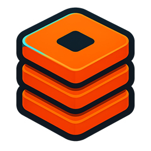
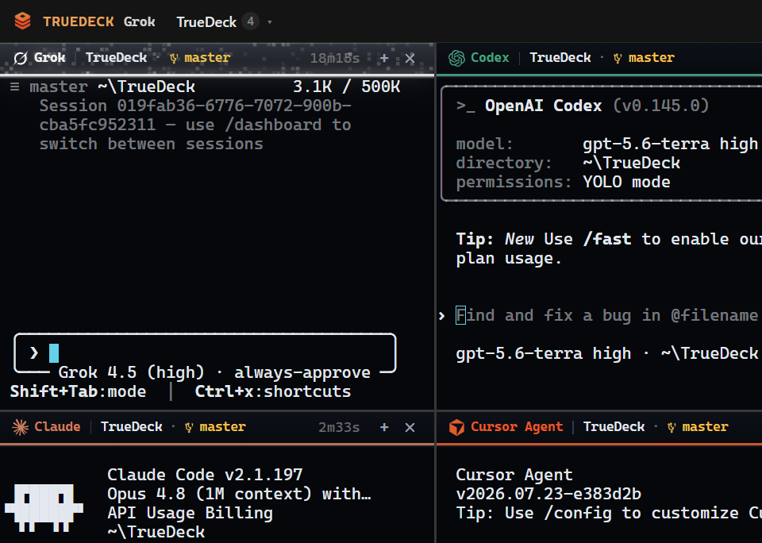

<p align="center">
  
</p>

# TrueDeck

**Agentic programming, without the ops.**

TrueDeck is a terminal-first deck for running coding agents side by side. Put Grok, Codex, Cursor, Claude, Gemini, and more on the same project, split into panes, and keep working. You stay in real agent CLIs, not a chat webview.

Memory, MCP wiring, and project context are **handled for you**. No note apps to babysit, no memory dashboards to configure, no Docker checklist before you can code. Open a folder, launch agents, ship.

[](./LICENSE)
[](https://github.com/WutIsHummus/TrueDeck/releases)
[](https://wutishummus.github.io/TrueDeck/)

<p align="center">
  
</p>

## Why TrueDeck

| Feature | Description |
| :--- | :--- |
| **Agentic, multi-CLI** | Several agents on one codebase at once, each in its own live terminal |
| **Abstracted memory** | Context and MCP sync run under the hood so you can ignore the plumbing |
| **Real TUIs** | Grok, Claude, Codex, Cursor keep their own interfaces |
| **Studio layout** | Tabs, splits, focus, restore - a desk for agents, not another IDE |

## Download

**Do not clone this repo to run the app.** Get installers and portable builds from the **[Releases](https://github.com/WutIsHummus/TrueDeck/releases)** tab.

## Docs

Guides, shortcuts, agents, configuration, troubleshooting:

**https://wutishummus.github.io/TrueDeck/**

## Develop from source

Contributors only. End users should use **[Releases](https://github.com/WutIsHummus/TrueDeck/releases)**.

```bash
git clone https://github.com/WutIsHummus/TrueDeck.git
cd TrueDeck
npm install
npm start
```

## License

MIT
